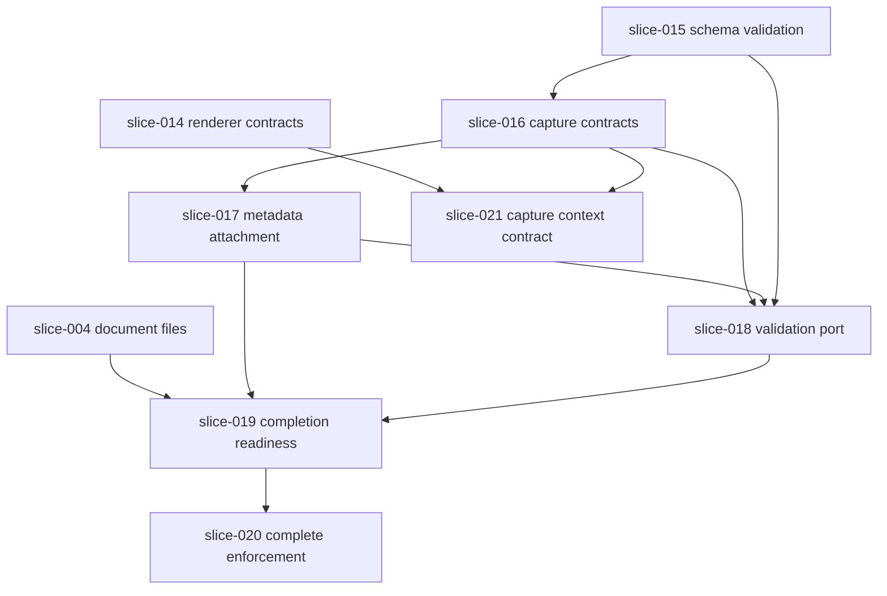

## Context

Wave 2 delivered version-scoped composition, layout, renderer contracts, and capture validation in `AIX.Metadata`. The `Document` aggregate in `AIX.Documents` already supports Draft creation bound to a `DocumentTypeVersionId`, file attachment (primary/supporting), and unconditional Draft → Complete transition — but it does not store captured metadata, validate metadata at capture time, or enforce capture readiness before completion.

Wave 3 — Capture MVP closes the gap between **configurable document schemas** and **controlled document capture** using the same domain-first, slice-driven discipline as Waves 0–2. This design defines six slices (016–021): slices 016–020 form the core capture completion path; slice 021 is last-priority and optional within Wave 3. All slices stay in domain and contracts layers until a future wave explicitly introduces persistence, APIs, or UI.

## Goals / Non-Goals

**Goals:**

- Create a draft document bound to a published document type version (existing behavior; preserved).
- Capture structured metadata against that version on the Document aggregate.
- Validate metadata using centralized Wave 2 validation (`VersionSchemaValidator` / `DocumentType.ValidateMetadataAgainstVersion`).
- Prepare completion rules that enforce metadata correctness and MVP file requirements before Complete.
- Define cross-BC contracts so Documents integrates with Metadata without direct domain references.
- Produce backlog slice files ready for atomic OpenSpec implementation changes.

**Non-Goals (deferred beyond Wave 3 MVP slices):**

- Persistence, EF Core, repositories, outbox
- HTTP APIs, controllers, MediatR
- Angular capture UI, PrimeNG, Avalon
- Runtime multi-tenancy implementation
- Physical storage providers, upload pipelines, antivirus, OCR
- Search, retention, workflows, governance policies
- `RuleSchema`, `FileRequirementSchema`, dataset resolution
- Full field catalog (SELECT, TABLE, FILE, RICH_TEXT)
- JSON Schema infrastructure validator
- Cross-BC integration tests in CI until contracts slice lands (optional in slice 016 tests only)

## Wave 3 Slice Map

| Slice | ID | Theme | Primary BC | Depends on |
|-------|-----|-------|------------|------------|
| 016 | `capture-metadata-contracts` | Passive cross-BC payload and validation result contracts (DTOs only; no behavioral ports) | `AIX.Documents.Contracts` (new) | 015 |
| 017 | `document-metadata-attachment` | Store/replace metadata on Draft; immutability after Complete | `AIX.Documents` | 016 |
| 018 | `capture-validation-port` | `ICaptureMetadataValidator` behavioral port + validation adapter; Documents integration with Metadata | `AIX.Documents` (port placement TBD: Application or Domain), `AIX.Documents.Contracts` (read DTOs), test adapter → `AIX.Metadata` | 016, 017, 015 |
| 019 | `document-completion-readiness` | Readiness policy: valid metadata + primary file | `AIX.Documents` | 017, 018, 004 |
| 020 | `complete-with-capture-enforcement` | `Complete()` requires capture readiness | `AIX.Documents` | 019 |
| 021 | `capture-context-contract` | Capture context DTO for future renderer/API (**last-priority, optional**) | `AIX.Documents.Contracts`, read `AIX.Metadata.Contracts` | 014, 016 |

### Dependency graph

### Execution order

**Core capture path (required):**

1. **016** — passive contracts first (creates `AIX.Documents.Contracts`; DTOs only)
2. **017** — metadata on Document (can accept unvalidated payload initially; validation added in 018)
3. **018** — define validation port and wire adapter; metadata updates require passing validation
4. **019** — readiness evaluation (metadata + primary file)
5. **020** — enforce readiness on `Complete()`

**Optional / last-priority:**

6. **021** — capture context contract for future renderer/API prep (not required for core capture completion; defer if Wave 3 scope must be reduced)

## Architecture

### Bounded context placement

| Layer | Project | Wave 3 role |
|-------|---------|-------------|
| Contracts | `AIX.Documents.Contracts` (**new**, slice 016) | Passive DTOs only: `CapturedMetadataPayload`, `CapturedMetadataGroupInstance`, `CaptureValidationResult`, `CaptureValidationError` |
| Application / Domain | `AIX.Documents.Application` or `AIX.Documents` (slice 018) | Behavioral port: `ICaptureMetadataValidator` — **not** in Contracts |
| Contracts | `AIX.Documents.Contracts` (slice 021, optional) | `DocumentCaptureContext` DTO for future renderer/API |
| Domain | `AIX.Documents` | Metadata value object on `Document`; readiness policy; enhanced `Complete()` |
| Domain | `AIX.Metadata` | Unchanged validation core; optional thin adapter in tests or `Application/` folder later |
| Contracts | `AIX.Metadata.Contracts` | Read-only consumption for schema projection in slice 021 |
| Tests | `AIX.Documents.Tests` | Behavioral tests for attachment, validation gate, readiness, complete enforcement |
| Tests | `AIX.Documents.Contracts.Tests` or Documents.Tests | Contract mapping tests if needed |

**No new references:** `AIX.Documents` → `AIX.Metadata.Domain` is forbidden. Validation crosses the boundary via:

1. `ICaptureMetadataValidator` behavioral port defined in slice **018** — **not** in `AIX.Documents.Contracts`. Final namespace/folder is selected during slice 018 implementation based on existing `AIX.Documents` structure:
   - **Preferred:** `AIX.Documents.Application` if the Application layer is used for ports
   - **Alternative:** `AIX.Documents.Domain` only if the aggregate method requires a domain-level abstraction
2. Method-parameter injection on aggregate operations (domain-friendly, same pattern as `IClock`)
3. Test adapter in `AIX.Documents.Tests` that references Metadata for integration-style unit tests

`AIX.Documents.Contracts` contains **only** passive DTO/result types: `CapturedMetadataPayload`, `CapturedMetadataGroupInstance`, `CaptureValidationResult`, `CaptureValidationError`. No behavioral ports.

Slice **016** creates `AIX.Documents.Contracts` and adds it to `backend/AIX.sln` with those passive contract types only.

### Document metadata model

Introduce a Documents-owned value type (e.g. `DocumentCapturedMetadata`) structurally aligned with `CapturedMetadataPayload` contract:

- Standalone values: `IReadOnlyDictionary<string, string?>` keyed by keyword code
- Group instances: list of `{ GroupCode, InstanceKey?, Values }`

`Document` gains:

- Optional `DocumentCapturedMetadata? Metadata` (null until first capture)
- `SetCapturedMetadata(payload, validationResult)` or two-step: validate via port, then attach
- `DocumentMetadataCaptured` domain event (past tense, includes document id and correlation)

### Validation ownership

| Concern | Owner |
|---------|-------|
| Structural schema rules (required fields, groups, unknown keys) | `VersionSchemaValidator` in Metadata |
| Keyword value rules | `KeywordValidator` in Metadata |
| Capture policy (hidden/deprecated rejected) | `VersionSchemaValidator` in Metadata |
| Whether Documents stores payload | `Document` aggregate in Documents |
| Orchestration (load type version + registry, call validator) | Application layer in future slice; **slice 018** defines the port and uses injected port in domain methods for testability |

Documents SHALL NOT duplicate validation logic. The validation port returns `CaptureValidationResult` mapped from Metadata's `SchemaValidationResult`.

### Completion readiness

Introduce `DocumentCaptureReadiness` (static evaluator or domain service) that checks:

1. Metadata is present
2. Metadata passes validation against bound version (via port)
3. Primary file is attached (`DocumentFileRole.Primary` exists per slice 004)

Slice 019 exposes `EvaluateReadiness(document, validator, ...)` returning `Result` or readiness value object.

Slice 020 changes `Complete()` to call readiness first; new errors e.g. `DocumentErrors.CaptureNotReady`, `DocumentErrors.MetadataRequired`, `DocumentErrors.PrimaryFileRequired`.

### Capture context contract (slice 021 — last-priority, optional)

For future renderer/API slices, define `DocumentCaptureContext` in `AIX.Documents.Contracts`. This slice is **not required** for the core capture completion path (016–020). It is **required only before** future API or UI renderer work begins. Defer if Wave 3 scope must be reduced.

Contents:

- Document identity (`DocumentId`, `DocumentTypeId`, `DocumentTypeVersionId`)
- Reference to projected `DocumentSchema` from `AIX.Metadata.Contracts` (by value, not live aggregate)
- Current captured metadata snapshot

Assembly happens in a small projector or factory in Documents (Application folder when created). No Angular in this slice.

### Events

| Event | When |
|-------|------|
| `DocumentMetadataCaptured` | Metadata set/replaced on Draft |
| `DocumentCreated` | Unchanged |
| `DocumentCompleted` | Unchanged; only emitted when capture-ready |
| `DocumentFileAttached` | Unchanged |

### Versioning and immutability

- Document remains bound to `DocumentTypeVersionId` from creation; metadata validation always uses that version.
- Complete documents reject metadata and file mutations (existing Wave 0 behavior preserved).
- Captured metadata on Complete documents is a frozen snapshot.

### Tenant isolation

Not implemented in Wave 3 domain slices. Design notes for future persistence slices:

- Captured metadata stored as JSONB per `docs/domain/document-type-versioning.md`
- Validation loads tenant-scoped registry and version snapshot from tenant DB
- No `tenant_id` on domain entities (canon)

## Testing strategy

| Slice | Test focus |
|-------|------------|
| 016 | Contract shape, immutability, no forbidden project references; no behavioral ports |
| 017 | Attach, replace, reject on Complete, event emission |
| 018 | Port definition, valid/invalid payload paths, multiple errors, hidden/deprecated rejection via adapter |
| 019 | Readiness matrix: metadata only, file only, both, neither |
| 020 | Complete succeeds/fails based on readiness; immutability after Complete |
| 021 | Capture context bundles correct ids + schema projection + metadata snapshot (optional slice) |

All slices: `cd backend && dotnet restore AIX.sln && dotnet build AIX.sln && dotnet test AIX.sln`

## Mapping to capability board

| Capability board item | Wave 3 slice coverage |
|-----------------------|----------------------|
| File Attachment Model | Already slice 004; referenced by 019 |
| Upload Pipeline | **Out of scope** — storage deferred |
| COMPLETE State | Slices 019–020 evolve with capture enforcement |
| Immutability Rules | Slices 017, 020 reinforce Wave 0 rules |
| Capture Renderer | Slice 021 contracts only (optional, last-priority); UI deferred |

## Future atomic OpenSpec changes

Each core slice 016–020 SHOULD become its own implementation change when `/opsx:apply` runs for that slice. Slice 021 MAY be deferred to a later wave or executed last within Wave 3. This planning change only produces backlog files and planning artifacts.

## Risks and mitigations

| Risk | Mitigation |
|------|------------|
| Duplicate `DocumentTypeId` types across BCs | Use GUID values + contracts; never reference Metadata domain types from Documents |
| Registry drift at capture time | Document as known MVP trade-off; defer keyword versioning |
| `Complete()` behavior change breaks existing tests | Slice 020 explicitly updates tests; readiness rules are additive domain rules |
| Validation port leaks Metadata into Documents domain | Port interface in Application or Domain (not Contracts); adapter lives in Application or test project only |
